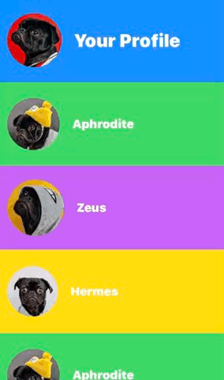

If you like it, consider to buy me a coffee! (If I continue this way, I'll pay more for coffees than for food!) <a href="https://www.buymeacoffee.com/NickPolychronakis" target="_blank"></a>


# ScrollViewWithCompletionHandler

A ScrollView with a header View, which executes a completion handler when the user swipes down and release.




To download the Swift Package, on Xcode go to File -> Swift Packages -> Add Package Dependency and write "https://github.com/nickpolychronakis/ScrollViewWithCompletionHandler"

**Example:**

```
ScrollViewWithCompletionHandler(header: {
    Text("Header View")
}, scrollDownCompletion: {
    print("Completion Handler, runs when the user swipes down and release.")
}) {
    Text("Here is the content of the ScrollView")
    Text("Row 1")
    Text("Row 2")
}
```

Parameter name | Details
---------------|---------
header: | A View that will be on top of ScrollView and will animate when you scroll.
scrollDownCompletion: | A completion handler that will be executed when the user swipe down the scroll view and release it.
content: | Content Views of ScrollView.
    

**ToDo:**
- [ ] Give the option to the developer to remove scroll indicators.
